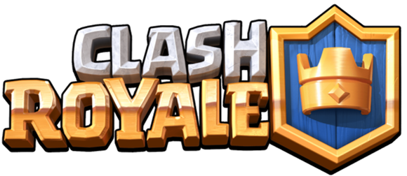
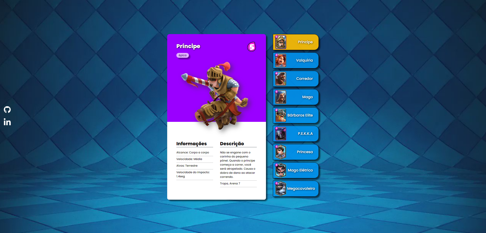
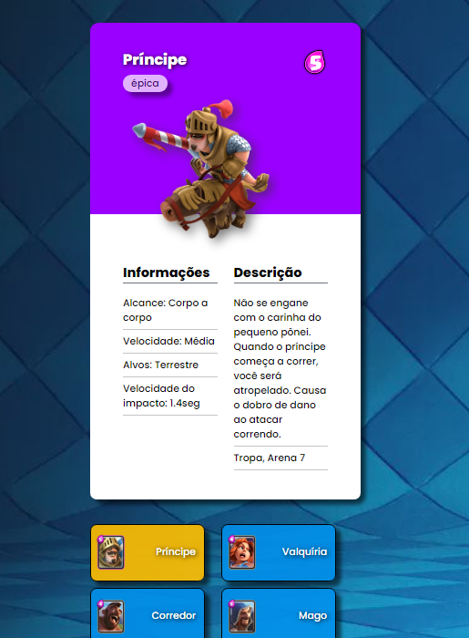

  

<h1 align="center">
  Andrey Santana Soares - Projeto "Clash Royale" ⚔👑
</h1>

  Este é um projeto pessoal <a href="https://drey021.github.io/Projeto-Clash-Royale/" target="_blank">Clash Royale Cards | By Andrey Soares,</a> realizado com HTML, CSS e JavaScript, atualmente hospedado no <a href="https://github.com/Drey021/Projeto-Clash-Royale">GitHub-Pages</a>.

## Desing: 
* Desktop:
[
](https://drey021.github.io/Projeto-Clash-Royale/)

* Mobile:
[
](https://drey021.github.io/Projeto-Clash-Royale/)

### 🔗 Link do Projeto: <a href="hhttps://drey021.github.io/Projeto-Clash-Royale/" target="_blank">https://drey021.github.io/Projeto-Clash-Royale/</a>

## Tecnologias utilizadas:

 * HTML
 * CSS
 * JAVASCRIPT

 ### Pra entrar em contato, veja as redes abaixo!
 

 
  
  
   

